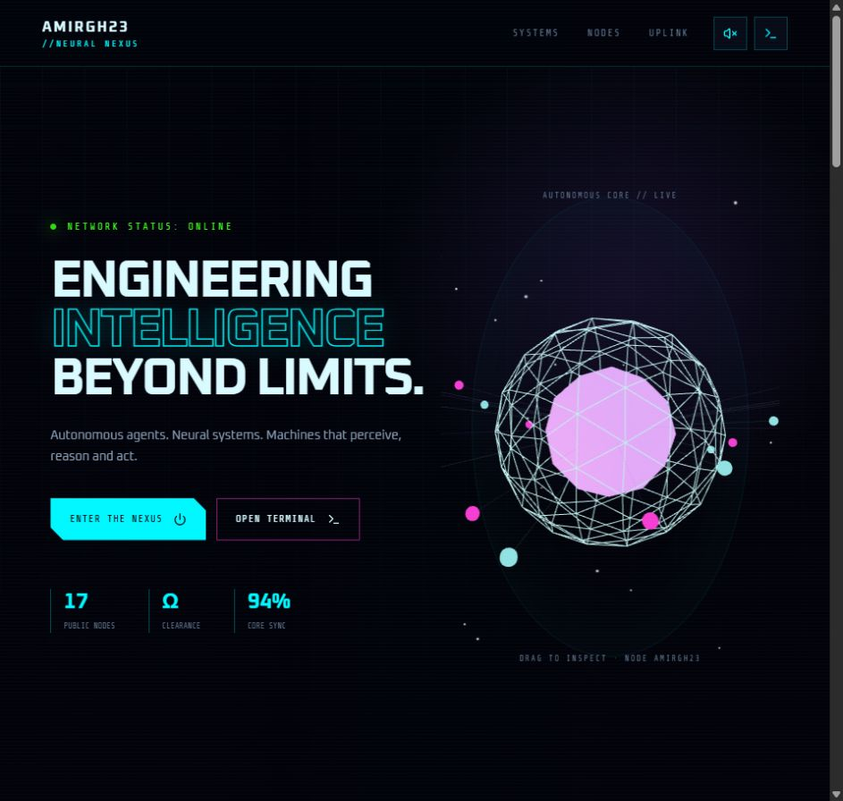
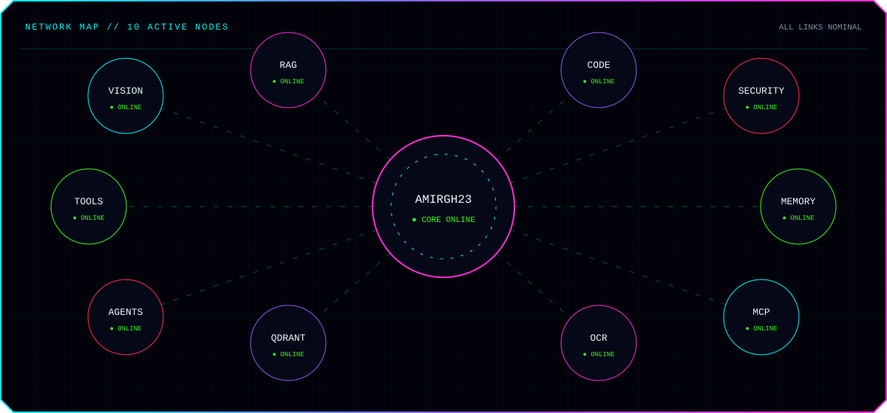
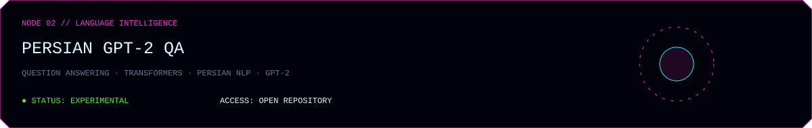
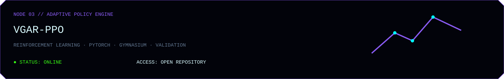

<a href="https://amirgh23.github.io/"><strong>ENTER THE INTERACTIVE NEURAL NEXUS ↗</strong></a>

THREE.JS CORE · INTERACTIVE TERMINAL · COMPLETE REPOSITORY NETWORK · SYSTEM ONLINE

 

 

 

 

 

 

 

 

 

 

