<div align="center">

<a href="https://amirgh23.github.io/">
  
</a>

<br />

<h1>
  <code>SYSTEM://AMIRGH23</code>
</h1>

<h3>AI Systems Engineer · Autonomous Intelligence Architect</h3>

<p>
  Designing local, agentic, retrieval-augmented, and production-oriented AI systems.
</p>

<p>
  <code>STATUS://ONLINE</code>
  &nbsp;·&nbsp;
  <code>LOCATION://MASHHAD_IR</code>
  &nbsp;·&nbsp;
  <code>CORE://AI_AND_ROBOTICS</code>
  &nbsp;·&nbsp;
  <code>CLEARANCE://OMEGA</code>
</p>

<br />

<a href="https://amirgh23.github.io/">
  
</a>

<br /><br />

<sub>
  THREE.JS NEURAL CORE
  &nbsp;·&nbsp;
  INTERACTIVE TERMINAL
  &nbsp;·&nbsp;
  AI RESEARCH NETWORK
  &nbsp;·&nbsp;
  PROJECT TELEMETRY
</sub>

<br /><br />

<a href="https://github.com/Amirgh23">
  
</a>
<a href="https://amirgh23.github.io/">
  
</a>
<a href="https://www.linkedin.com/in/amirreza-ghaffarian-nokhodi-55371020b">
  
</a>

</div>

<br />

---

<div align="center">

<a href="#operator-profile"><code>OPERATOR</code></a>
 ·  <a href="#current-focus"><code>CURRENT FOCUS</code></a>
 ·  <a href="#core-domains"><code>CORE DOMAINS</code></a>
 ·  <a href="#architecture"><code>ARCHITECTURE</code></a>
 ·  <a href="#capability-matrix"><code>CAPABILITIES</code></a>
 ·  <a href="#research-nodes"><code>RESEARCH</code></a>
 ·  <a href="#telemetry"><code>TELEMETRY</code></a>
 ·  <a href="#uplink"><code>UPLINK</code></a>

</div>

---

<a id="operator-profile"></a>

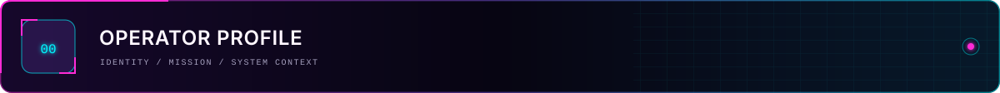

<table>
<tr>
<td width="63%" valign="top">

### `IDENTITY://AMIRREZA_GHAFFARIAN`

I'm **Amirreza Ghaffarian**, an AI and robotics engineer focused on designing intelligent systems that move beyond isolated model demos and operate as complete, dependable software systems.

My work connects:

* machine learning research,
* large language models,
* autonomous agent workflows,
* retrieval and knowledge systems,
* local AI infrastructure,
* and intelligent user interfaces.

I am particularly interested in systems that can **perceive information, retrieve knowledge, reason over context, use tools, learn from feedback, and execute reliable actions**.

My engineering approach combines AI research with practical software architecture, allowing complex models to become observable, controllable, and useful in real-world environments.

</td>
<td width="37%" valign="top">

```text
CODENAME
AMIRGH23

ROLE
AI SYSTEMS ENGINEER

SPECIALIZATION
AUTONOMOUS INTELLIGENCE

ACADEMIC CORE
AI & ROBOTICS M.Sc.

BASE
MASHHAD · IRAN

CURRENT STATE
RESEARCHING
BUILDING
OPTIMIZING
```

</td>
</tr>
</table>

> ### `THE FUTURE IS NOT PREDICTED.`
>
> ### `IT IS ENGINEERED.`

```yaml
operator:
  name: Amirreza Ghaffarian
  codename: AMIRGH23
  role: AI Systems Engineer
  academic_field: AI and Robotics

mission:
  build: production-oriented intelligent systems
  connect: research with reliable software
  optimize: models for real-world constraints
  expose: intelligence through usable interfaces

primary_interests:
  - Large Language Models
  - Retrieval-Augmented Generation
  - Autonomous AI Agents
  - Reinforcement Learning
  - Persian Language Intelligence
  - Local and Secure AI Infrastructure
```

<details>
<summary><code>OPEN://RETRO_ASCII_OPERATOR_PORTRAIT</code></summary>

<br />

<div align="center">

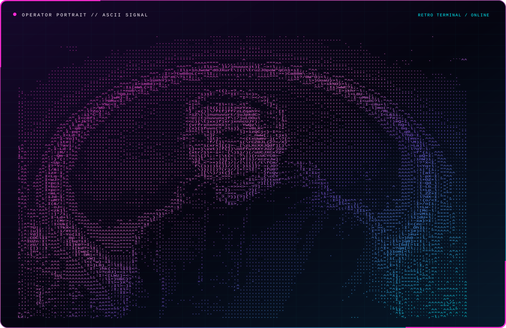

</div>

</details>

---

<a id="current-focus"></a>

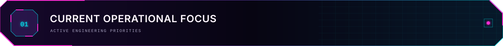

<table>
<tr>
<td width="50%" valign="top">

### `01.1 // ENTERPRISE AI ARCHITECTURE`

Designing modular AI platforms that connect language models, reasoning models, retrieval systems, visual understanding, reranking, tools, memory, and user interfaces.

`MULTI-MODEL` · `MODULAR` · `OBSERVABLE` · `PRODUCTION-ORIENTED`

</td>
<td width="50%" valign="top">

### `01.2 // LOCAL INTELLIGENCE`

Running and optimizing AI systems on local infrastructure with an emphasis on privacy, predictable cost, hardware efficiency, and organizational control.

`LOCAL LLM` · `GPU INFERENCE` · `PRIVATE AI` · `ON-PREMISE`

</td>
</tr>

<tr>
<td width="50%" valign="top">

### `01.3 // AGENTIC SYSTEMS`

Building agents capable of tool use, structured reasoning, workflow orchestration, memory management, evaluation, and dependable task execution.

`LANGGRAPH` · `MCP` · `TOOLS` · `MEMORY` · `EVALUATION`

</td>
<td width="50%" valign="top">

### `01.4 // INTELLIGENT INTERFACES`

Creating React and TypeScript interfaces that make AI reasoning, retrieval, system state, and complex workflows visible and controllable.

`REACT` · `TYPESCRIPT` · `AI UX` · `SYSTEM TELEMETRY`

</td>
</tr>
</table>

---

<a id="core-domains"></a>

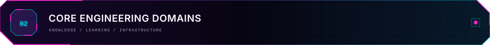

### `02.1 // LARGE LANGUAGE MODEL ENGINEERING`

* Local deployment and serving of open-weight language models
* Instruction-tuned and reasoning-oriented model integration
* Context management and prompt architecture
* Structured outputs and reliable tool calling
* Model routing and multi-model workflow design
* Latency, throughput, memory, and inference optimization

`LLM` · `REASONING` · `MODEL ROUTING` · `STRUCTURED OUTPUT`

<br />

### `02.2 // RETRIEVAL-AUGMENTED GENERATION`

* Document ingestion and knowledge preparation
* Semantic, hybrid, and metadata-aware retrieval
* Embedding pipelines and vector databases
* Reranking and context selection
* Grounded answer generation
* Retrieval evaluation and hallucination reduction
* Agentic and multi-stage RAG workflows

`RAG` · `EMBEDDINGS` · `QDRANT` · `RERANKING` · `GROUNDING`

<br />

### `02.3 // AUTONOMOUS AGENTS`

* Agent state and workflow orchestration
* Tool and function calling
* Short-term and persistent memory
* Human-in-the-loop execution
* Multi-agent task decomposition
* Failure handling and controlled retries
* Agent evaluation, tracing, and observability

`AGENTIC AI` · `LANGGRAPH` · `MCP` · `ORCHESTRATION`

<br />

### `02.4 // MODEL ADAPTATION`

* Supervised fine-tuning
* Parameter-efficient fine-tuning
* LoRA and QLoRA workflows
* Dataset preparation and chat formatting
* Domain and behavior specialization
* Fine-tuning experimentation with Unsloth
* Model validation before deployment

`UNSLOTH` · `LORA` · `QLORA` · `SFT` · `DATASET ENGINEERING`

<br />

### `02.5 // PERSIAN LANGUAGE INTELLIGENCE`

* Persian question answering
* Text classification and sentiment analysis
* Summarization and information extraction
* Persian retrieval and semantic search
* Document-oriented AI assistants
* Persian OCR and multimodal document understanding

`PERSIAN NLP` · `QA` · `SUMMARIZATION` · `OCR`

<br />

### `02.6 // REINFORCEMENT LEARNING`

* Policy optimization
* Proximal Policy Optimization
* Continuous-control environments
* Adaptive rollout strategies
* Experiment design and validation
* Reproducible reinforcement learning research

`PYTORCH` · `PPO` · `GYMNASIUM` · `POLICY OPTIMIZATION`

<br />

### `02.7 // VISION AND DOCUMENT INTELLIGENCE`

* Optical character recognition
* Visual-language model integration
* Document understanding
* Image and text extraction pipelines
* Multimodal retrieval
* Vision-assisted organizational knowledge systems

`COMPUTER VISION` · `OCR` · `VLM` · `MULTIMODAL AI`

<br />

### `02.8 // AI INFRASTRUCTURE`

* GPU-based local inference
* Quantized model deployment
* High-throughput model serving
* On-premise AI systems
* Air-gapped deployment architecture
* Privacy-oriented model execution
* Resource-aware model selection

`VLLM` · `QUANTIZATION` · `GPU SERVING` · `AIR-GAPPED AI`

---

<a id="architecture"></a>

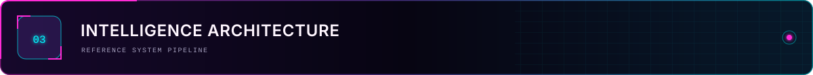

<div align="center">

```text
┌────────────────────────────────────────────────────────────────────┐
│                         HUMAN INTERFACE                            │
│          React · TypeScript · Dashboards · AI Workspaces           │
└──────────────────────────────┬─────────────────────────────────────┘
                               │
┌──────────────────────────────▼─────────────────────────────────────┐
│                        AGENTIC CONTROL                             │
│       Workflow Graphs · Tools · Memory · Policies · Evaluation     │
└──────────────────────────────┬─────────────────────────────────────┘
                               │
┌──────────────────────────────▼─────────────────────────────────────┐
│                       INTELLIGENCE CORE                            │
│          LLM · Reasoning Model · Vision Model · Model Router       │
└──────────────────────────────┬─────────────────────────────────────┘
                               │
┌──────────────────────────────▼─────────────────────────────────────┐
│                         KNOWLEDGE LAYER                            │
│      OCR · Embeddings · Hybrid Retrieval · Qdrant · Reranking      │
└──────────────────────────────┬─────────────────────────────────────┘
                               │
┌──────────────────────────────▼─────────────────────────────────────┐
│                     INFERENCE INFRASTRUCTURE                       │
│       Local GPU · Quantization · vLLM · On-Premise Deployment      │
└────────────────────────────────────────────────────────────────────┘
```

</div>

<br />

### `REFERENCE PIPELINE`

```text
RAW DATA
   │
   ▼
PARSING + OCR + VISUAL UNDERSTANDING
   │
   ▼
CHUNKING + METADATA + EMBEDDING
   │
   ▼
VECTOR / HYBRID RETRIEVAL
   │
   ▼
RERANKING + CONTEXT COMPOSITION
   │
   ▼
LLM / REASONING MODEL
   │
   ▼
AGENT TOOLS + CONTROLLED ACTIONS
   │
   ▼
REACT / TYPESCRIPT INTERFACE
```

---

<a id="capability-matrix"></a>

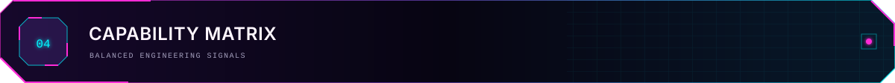

<div align="center">


</div>

<br />

<table>
<tr>
<th align="left">DOMAIN</th>
<th align="left">SYSTEMS & CONCEPTS</th>
<th align="left">TOOLS & TECHNOLOGIES</th>
</tr>

<tr>
<td valign="top"><strong>Language Intelligence</strong></td>
<td valign="top">LLMs, reasoning models, Persian NLP, structured generation</td>
<td valign="top"><code>Transformers</code> <code>PyTorch</code> <code>Unsloth</code></td>
</tr>

<tr>
<td valign="top"><strong>Knowledge Systems</strong></td>
<td valign="top">RAG, embeddings, hybrid retrieval, reranking, grounding</td>
<td valign="top"><code>Qdrant</code> <code>BGE-M3</code> <code>Vector Search</code></td>
</tr>

<tr>
<td valign="top"><strong>Autonomous Systems</strong></td>
<td valign="top">Agents, tools, memory, graph workflows, multi-agent systems</td>
<td valign="top"><code>LangGraph</code> <code>MCP</code> <code>Tool Calling</code></td>
</tr>

<tr>
<td valign="top"><strong>Model Adaptation</strong></td>
<td valign="top">SFT, LoRA, QLoRA, dataset engineering, specialization</td>
<td valign="top"><code>Unsloth</code> <code>PEFT</code> <code>QLoRA</code></td>
</tr>

<tr>
<td valign="top"><strong>Learning Systems</strong></td>
<td valign="top">Reinforcement learning, PPO, adaptive experimentation</td>
<td valign="top"><code>PyTorch</code> <code>Gymnasium</code> <code>PPO</code></td>
</tr>

<tr>
<td valign="top"><strong>Vision Intelligence</strong></td>
<td valign="top">OCR, document understanding, multimodal pipelines</td>
<td valign="top"><code>VLM</code> <code>PaddleOCR</code> <code>Vision Pipelines</code></td>
</tr>

<tr>
<td valign="top"><strong>Inference Engineering</strong></td>
<td valign="top">Quantization, GPU serving, throughput and VRAM optimization</td>
<td valign="top"><code>vLLM</code> <code>AWQ</code> <code>Local GPU</code></td>
</tr>

<tr>
<td valign="top"><strong>Intelligent Interfaces</strong></td>
<td valign="top">AI dashboards, observability, interactive system control</td>
<td valign="top"><code>React</code> <code>TypeScript</code> <code>Three.js</code></td>
</tr>
</table>

<br />

<div align="center">


</div>

---


<table>
<tr>
<td width="50%" valign="top">

### `05.1 // BUILD BEYOND THE DEMO`

A successful AI system must remain useful after the initial demonstration. It needs monitoring, evaluation, predictable behavior, maintainable architecture, and controlled failure modes.

</td>
<td width="50%" valign="top">

### `05.2 // LOCAL WHEN IT MATTERS`

Local deployment provides privacy, control, predictable infrastructure costs, customization, and the ability to operate in restricted environments.

</td>
</tr>

<tr>
<td width="50%" valign="top">

### `05.3 // RETRIEVE BEFORE GENERATING`

Knowledge-intensive systems should ground their outputs in relevant evidence rather than relying only on model parameters.

</td>
<td width="50%" valign="top">

### `05.4 // MAKE INTELLIGENCE OBSERVABLE`

Users and engineers should be able to understand what the system retrieved, which tool it used, what state it entered, and why an action occurred.

</td>
</tr>

<tr>
<td width="50%" valign="top">

### `05.5 // EVALUATE THE COMPLETE PIPELINE`

Model quality alone is not enough. Retrieval, tool execution, latency, memory consumption, failure recovery, and user experience must also be measured.

</td>
<td width="50%" valign="top">

### `05.6 // OPTIMIZE FOR REAL CONSTRAINTS`

Architecture must account for GPU memory, inference speed, deployment environment, privacy requirements, maintenance cost, and system reliability.

</td>
</tr>
</table>

---

<a id="research-nodes"></a>


<table>
<tr>
<td width="50%" valign="top">

### [`R-01 // LOCAL RAG CLASSROOM`](https://github.com/Amirgh23/rag-class-project)

A dependency-free local retrieval-augmented generation system designed for clarity, inspectability, and classroom experimentation.

**Research signal**

* Local retrieval pipeline
* Transparent system behavior
* Educational implementation
* Knowledge-grounded generation

<br />

`Python` `RAG` `Local AI` `Information Retrieval`

<br />

[ **ACCESS REPOSITORY ↗** ](https://github.com/Amirgh23/rag-class-project)

</td>
<td width="50%" valign="top">

### [`A-02 // VGAR-PPO`](https://github.com/Amirgh23/vgar-ppo)

Validation-gated adaptive rollout reuse for PPO in continuous-control reinforcement learning environments.

**Research signal**

* Policy optimization
* Adaptive rollout reuse
* Validation-gated learning
* Continuous-control experimentation

<br />

`PyTorch` `PPO` `Gymnasium` `Reinforcement Learning`

<br />

[ **ACCESS REPOSITORY ↗** ](https://github.com/Amirgh23/vgar-ppo)

</td>
</tr>

<tr>
<td width="50%" valign="top">

### [`L-03 // PERSIAN GPT-2 QA`](https://github.com/Amirgh23/persian-gpt2-qa)

A Persian question-answering experiment exploring transformer-based language intelligence.

**Research signal**

* Persian NLP
* Transformer adaptation
* Question answering
* Language model experimentation

<br />

`Python` `Transformers` `Persian NLP` `Question Answering`

<br />

[ **ACCESS REPOSITORY ↗** ](https://github.com/Amirgh23/persian-gpt2-qa)

</td>
<td width="50%" valign="top">

### [`O-04 // PC-EHOA FEATURE SELECTION`](https://github.com/Amirgh23/pc-ehoa-feature-selection)

Perturbation-consensus feature selection with reproducible experiments, ablation studies, and an implementation-oriented research paper.

**Research signal**

* Optimization algorithms
* Feature-selection stability
* Ablation studies
* Reproducible experimentation

<br />

`Python` `Optimization` `Feature Selection` `Research`

<br />

[ **ACCESS REPOSITORY ↗** ](https://github.com/Amirgh23/pc-ehoa-feature-selection)

</td>
</tr>
</table>

<br />

<div align="center">

<a href="https://amirgh23.github.io/#projects">
  
</a>

</div>

---


Beyond research experiments, my work also explores the architecture of applied AI systems for real operational environments.

<table>
<tr>
<td width="33%" valign="top">

### `AI-CRM`

Intelligent customer relationship systems with structured customer data, contextual follow-up, sales assistance, and automated workflows.

</td>
<td width="33%" valign="top">

### `AI-ERP`

AI-assisted inventory, pricing, sales, reporting, document generation, and operational decision support.

</td>
<td width="33%" valign="top">

### `KNOWLEDGE AGENTS`

Organizational assistants capable of searching private knowledge, understanding documents, using tools, and producing grounded responses.

</td>
</tr>
</table>

```text
BUSINESS DATA
     │
     ├──► CUSTOMER INTELLIGENCE
     ├──► DOCUMENT UNDERSTANDING
     ├──► INVENTORY AND PRICING
     ├──► KNOWLEDGE RETRIEVAL
     ├──► WORKFLOW AUTOMATION
     └──► DECISION SUPPORT
```

---

<a id="telemetry"></a>

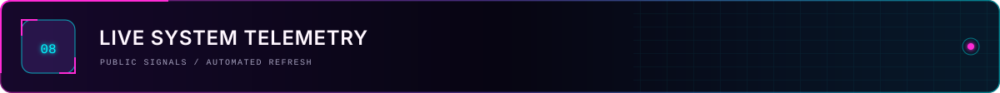

<div align="center">

### `NEURAL CORE // SYSTEM DIAGNOSTICS`


<br /><br />

### `PUBLIC NETWORK // ACTIVITY STREAM`


</div>

---

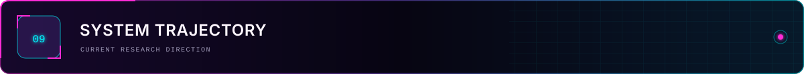

```text
RESEARCH
   └──► EXPERIMENTATION
          └──► VALIDATION
                 └──► SYSTEM ARCHITECTURE
                        └──► LOCAL DEPLOYMENT
                               └──► INTELLIGENT INTERFACE
                                      └──► REAL-WORLD OPERATION
```

### `CURRENT TRAJECTORY`

* Expanding local and private AI infrastructure
* Engineering dependable agentic workflows
* Developing Persian knowledge and document systems
* Improving model efficiency on limited GPU resources
* Connecting AI agents to operational business software
* Building interfaces for observable and controllable intelligence

---

<a id="uplink"></a>


<table>
<tr>
<td width="55%" valign="top">

### `NETWORK ENDPOINTS`

**GitHub Network**
[github.com/Amirgh23](https://github.com/Amirgh23)

<br />

**Interactive Neural Nexus**
[amirgh23.github.io](https://amirgh23.github.io/)

<br />

**Professional Uplink**
[LinkedIn · Amirreza Ghaffarian](https://www.linkedin.com/in/amirreza-ghaffarian-nokhodi-55371020b)

<br />

**Operating Location**
Mashhad, Iran

</td>
<td width="45%" valign="top">

```text
OPERATOR       AMIRGH23
DOMAIN         AI · ROBOTICS
SPECIALTY      AUTONOMOUS SYSTEMS
MODELS         LOCAL · AGENTIC · MULTIMODAL
INTERFACES     REACT · TYPESCRIPT
DEPLOYMENT     ON-PREMISE · PRIVATE
OBJECTIVE      PRODUCTION-GRADE AI
UPLINK         AVAILABLE
```

</td>
</tr>
</table>

<br />

<div align="center">

<a href="https://amirgh23.github.io/">
  
</a>

<br /><br />

<code>CONNECTION://SECURE</code>
 ·  <code>NEURAL_CORE://ACTIVE</code>
 ·  <code>KNOWLEDGE_BASE://SYNCHRONIZED</code>
 ·  <code>TRANSMISSION://COMPLETE</code>

<br /><br />

<sub>
  DESIGNED · ENGINEERED · MAINTAINED BY
  <a href="https://github.com/Amirgh23"><strong>AMIRGH23</strong></a>
</sub>

<br /><br />

<sub>
  BUILDING INTELLIGENCE THAT WORKS BEYOND THE DEMO.
</sub>

</div>
